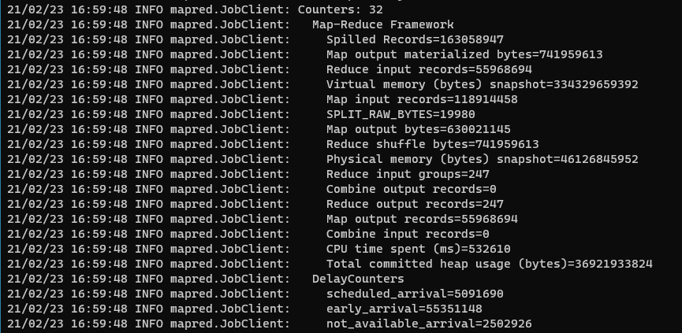
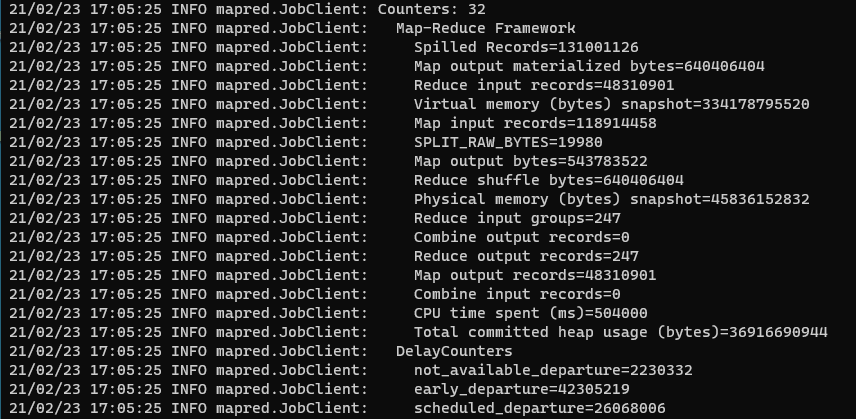

## Using Counters Airline Data Analyzing
The Counter is a log message that appears after the MapReduce run.

You can define counter using API. So, if you want to watching map or reduce logic, then define counter and use.

Even more, you can increment or decrement counters. Therefore, it can be operated efficiently.

#### Using
* Define counters by using enum class.
* Using getCounter method in Context Object.
* Like this : `context.getCounter(DelayCounters.scheduled_departure).increment(1)`
* If you all ready, run MapReduce. Then you can see the log message.

#### Results

