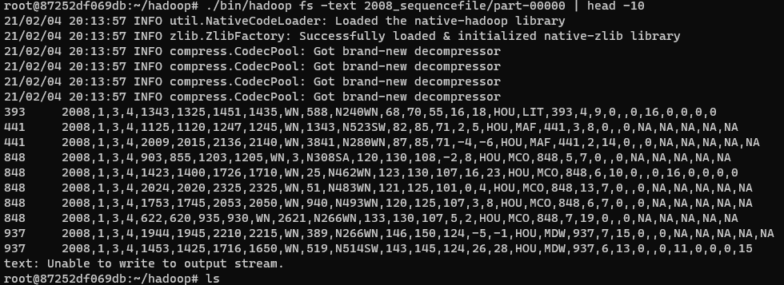

## Hadoop Partial Sort
#### Concepts
Partial sort is changing a mapper output data to a map file. And then search the data in map file.

These Techniques are often used data search.

Map file is consist of `index file` and `data file`. Index files are physically indexed. The data file contains the data contents of data are stored.
#### Steps
* First, making input data to sequence file.

* Second, change the sequence file to a map file.

* Third, Search a data in map file.
#### Result

