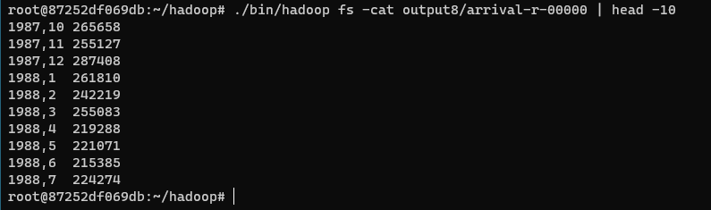
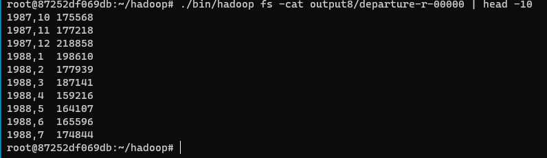

## Air Output Data Sort using Secondary Sort
Details, please see my code.

#### Usages
```
./bin/hadoop jar AirlinePerformanceParser_Sorting.jar DelayCountWithDateKey input delay_count_sort
```

#### Results



