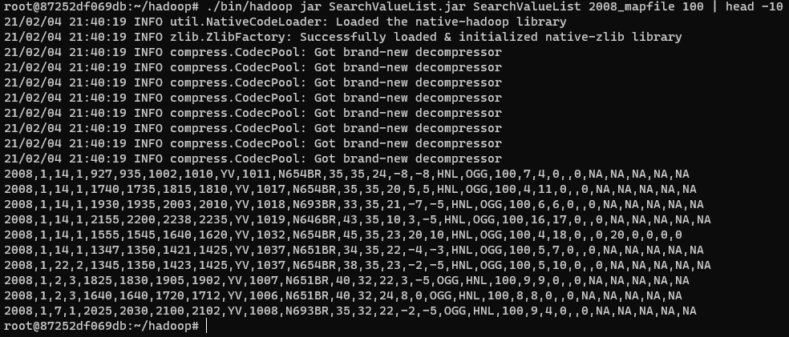

## Search Value in Map File
This project is belong to partial sort.

#### Uses
Before run this program, you have to delete log file in 2008_mapfile. Because `MapFileOutputFormat Class` is checking log file, So, they don't know where is a map file.
```
./bin/hadoop fs -rmr 2008_mapfile/_*
```
```
./bin/hadoop jar SearchValueList.jar SearchValueList 2008_mapfile 100 | head -10
```
#### Results
