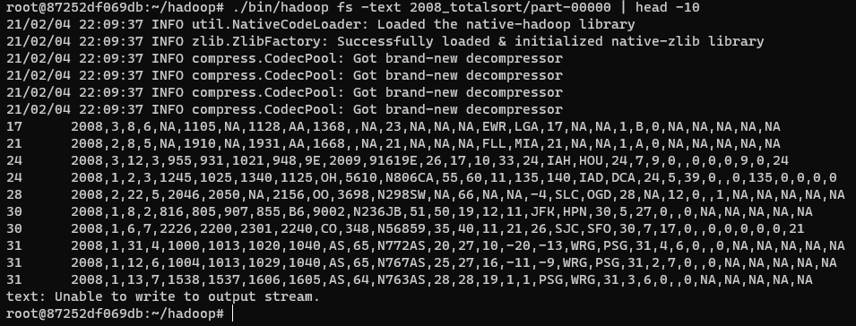

## Hadoop Total Sort

#### Steps
* First, Investigate the distribution plot of the data by sampling the input data.
* Second, pre-generate partition info to match the distribution plot of the data.
* Third, generate output data according to the pre-generate partition info.
* Lastly, merge each output data

#### Usages
```
./bin/hadoop jar SequenceFileTotalSort.jar SequenceFileTotalSort 2008_sequencefile 2008_totalsort
```

#### Results
